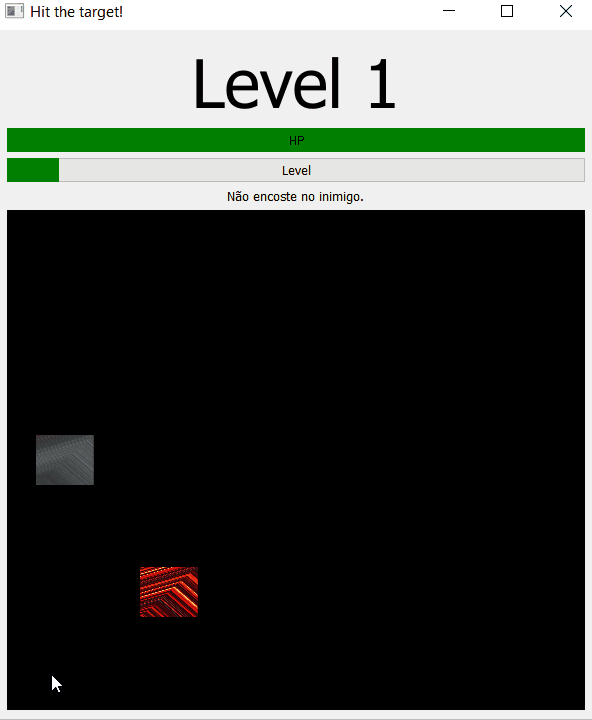

# Qt-runaway

Projeto final de Computação Gráfica 2018.3

Utilizado shaders, interação com teclado e textura.

Aperte WASD para mover o personagem (que pode ser interpretado como uma nave no espaço) e desvie do inimigo (que pode ser interpretado como um asteroide quadrado pegando fogo).

Quando mais tempo conseguir desviar, maior o level alcançado.

Acompanhe a barrinha de HP para saber se você vai morrer ou não.

É isto.